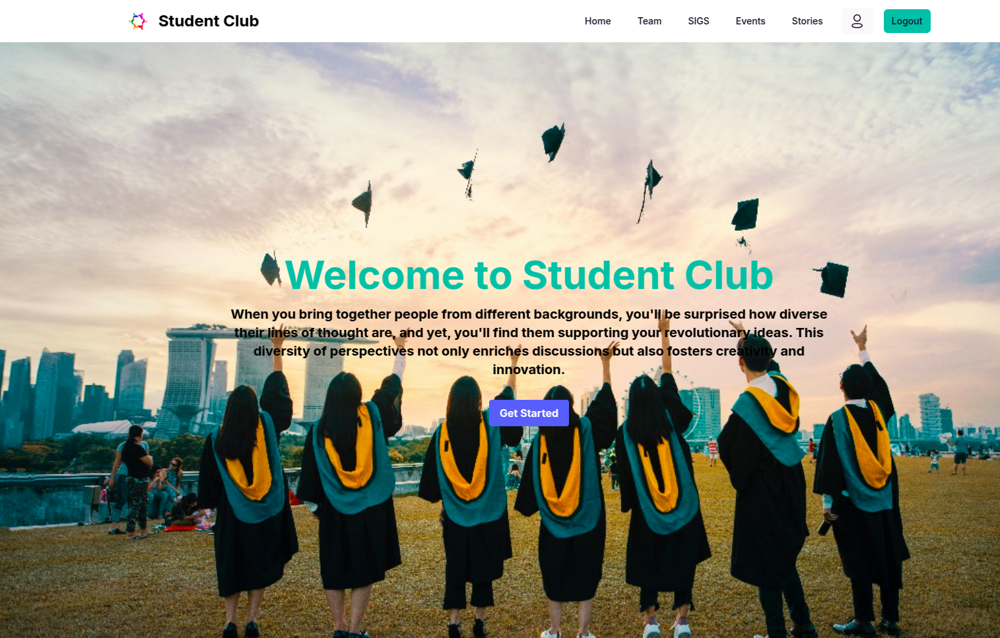
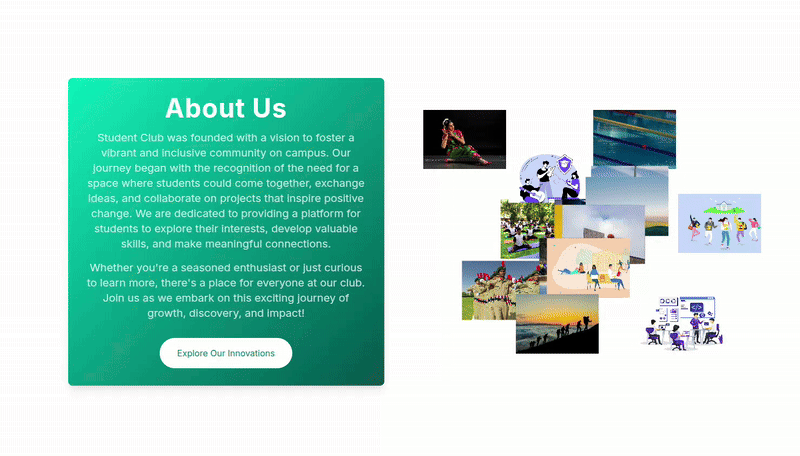
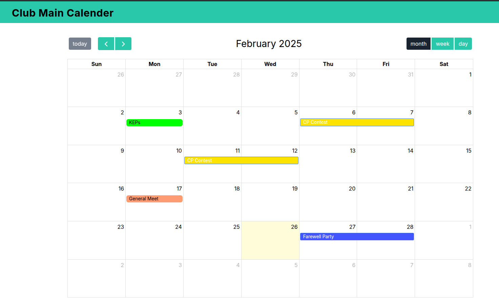
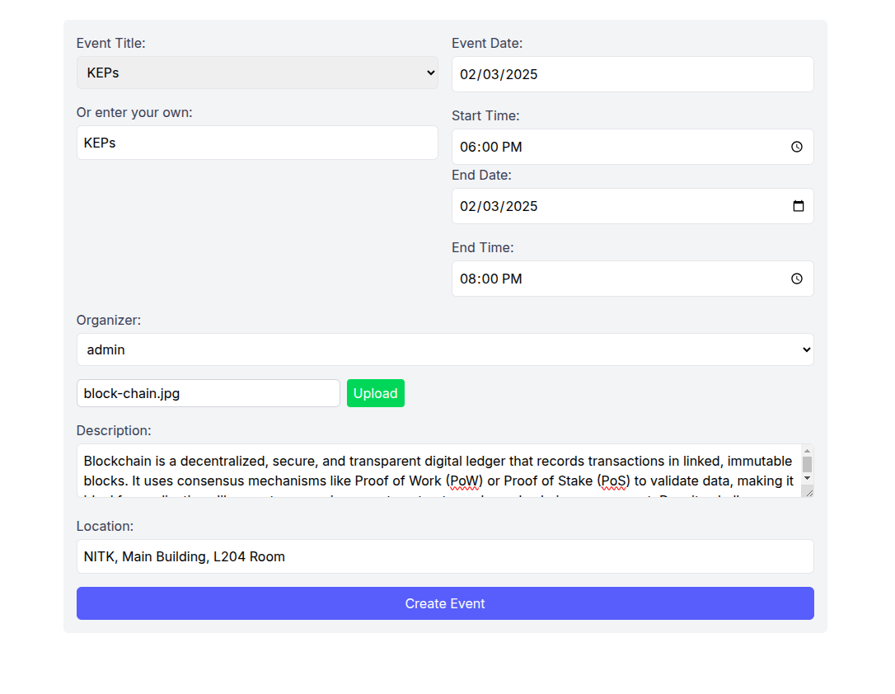
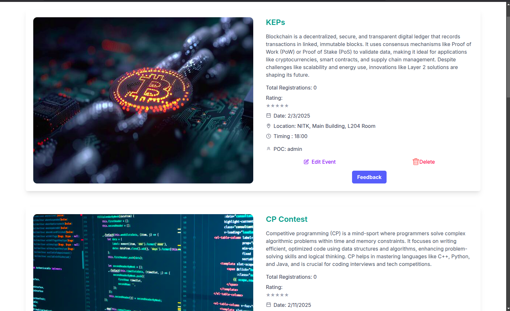

## Club Event Management

### Overview
The Club Event Management System is a comprehensive web application built to streamline event organization within clubs or organizations. Powered by Mycalendar.js library, it provides a fully-fledged calendar interface for admins to schedule and manage events effortlessly. Users can explore upcoming events, register for participation, and provide feedback for concluded events, enhancing engagement and community interaction.

# Demo

### Features
- Event Scheduling: Admins can easily create, update, and delete events on the calendar.
- Event Details: Each event listing includes essential information such as date, time, venue, and event description.
- User Registration: Users can register for events directly through the platform.
- Feedback System: Participants can provide feedback and rating for attended events, facilitating continuous improvement.
- Responsive Design: The application is designed to adapt seamlessly to various devices and screen sizes.
